# Nexon Museum Metal Badge Keychain Adapter

This is Fan-Made 3D model of the Nexon Museum Metal Badge Keychain Adapter. It is designed to hold the metal badge and can be attached to a keychain.

## Environment
- Printer: Bambu Lab A1 Combo
- Materials:
  | Printer | Brand | Material | Type | Color | Code |
  |-|-|-|-|-|-|
  | Base | eSUN | PLA | Matte | Milky White | #FFFFFB
  | Arona | eSUN | PLA | Matte | Light Blue | #6BC5F5
  | Plana | eSUN | PLA+ | Basic | Strawberry Red | #F57575
  | Momoi | eSUN | PLA+ | Basic | Pink | #EF7AA4
  | Midori | eSUN | PLA+ | Basic | Peak Green | #BAFF72
  | Yuzu | eSUN | PLA+ | Basic | Yellow | #FFFF00 
  | Aris | eSUN | PLA | Matte | Dark Grey | #36454F

## How to Print

Download the 3mf file and print it with your preferred slicer. Multiple colors can be printed using the multi-material feature of your printer, or by pausing the print at specific layers to change filament.

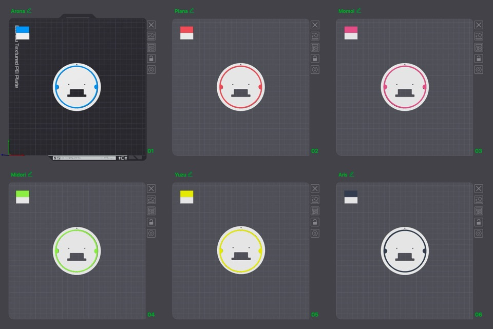

## Assembly

Here are the steps to assemble the Nexon Museum Metal Badge Keychain Adapter:

1. 프린트한 어댑터와 메탈 배지를 모두 준비합니다.  
   Gather all the printed adapter and the metal badge.
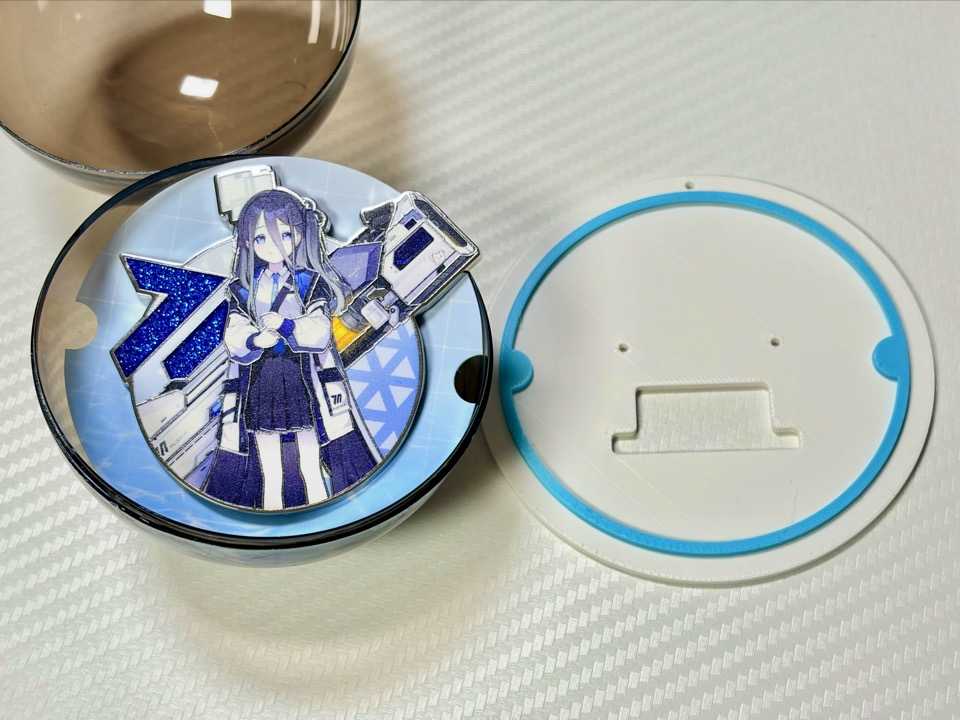

1. 메탈 배지를 아직 분리하지 않았다면, 뒷면 시트에서 분리합니다.  
   Detach the metal badge from its backing sheet if it is still attached.
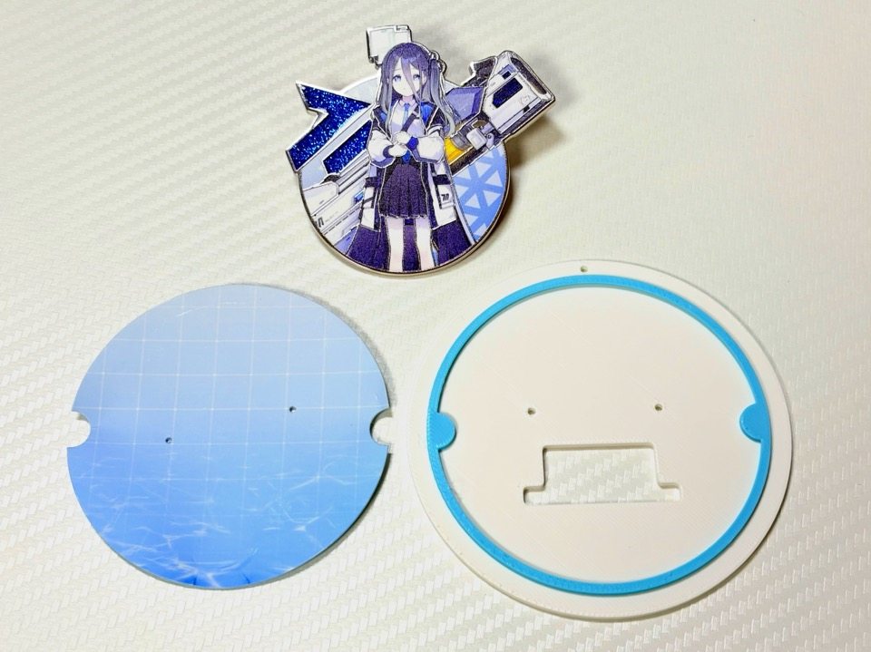

1. 뒷면 시트를 어댑터의 지정된 슬롯에 삽입합니다.  
   Insert the backing sheet into the designated slot on the adapter.
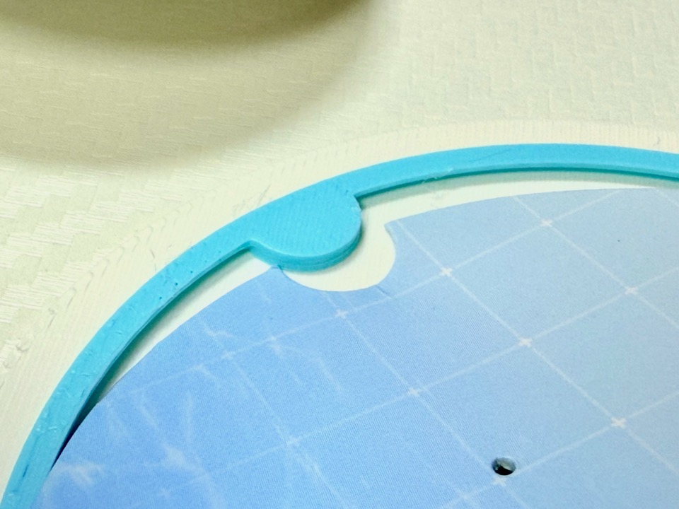
  
1. 일자 드라이버를 사용하면 쉽게 삽입할 수 있습니다.  
   If the backing sheet is not inserted properly, you can use a flathead screwdriver to help insert it easily.
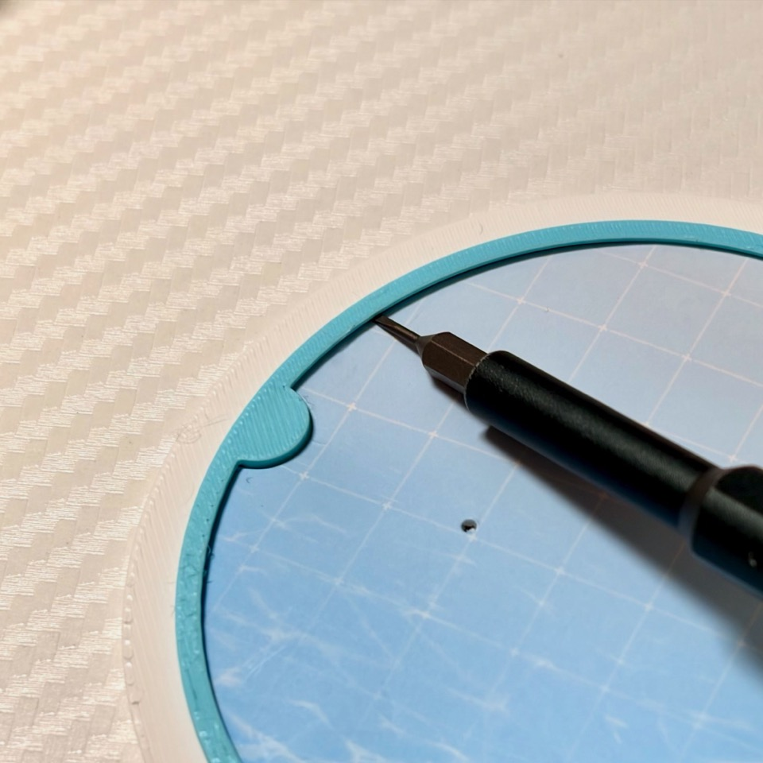

1. 어댑터의 후면에 있는 구멍에 뱃지의 핀을 통과시켜 구멍을 뚫어줍니다.  
   Pass the pin of the badge through the hole on the back of the adapter to secure it in place.
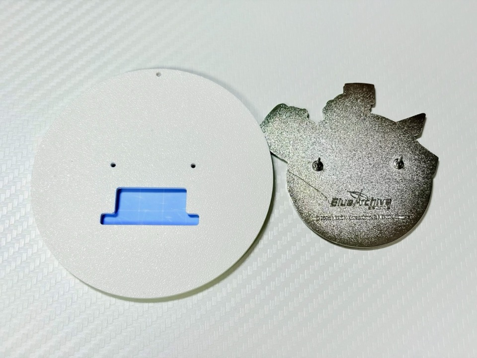
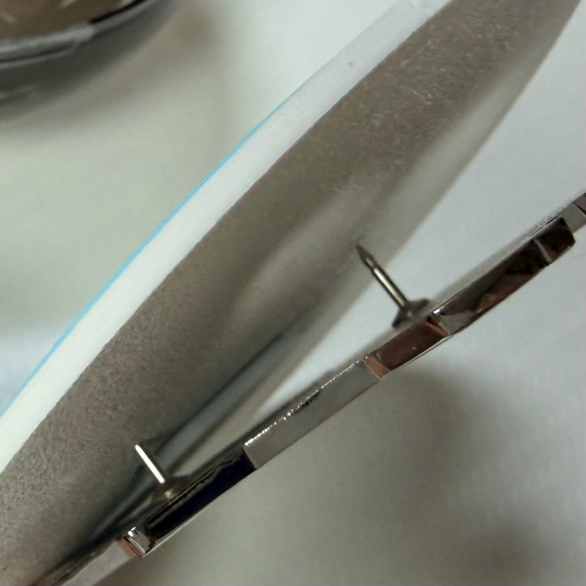
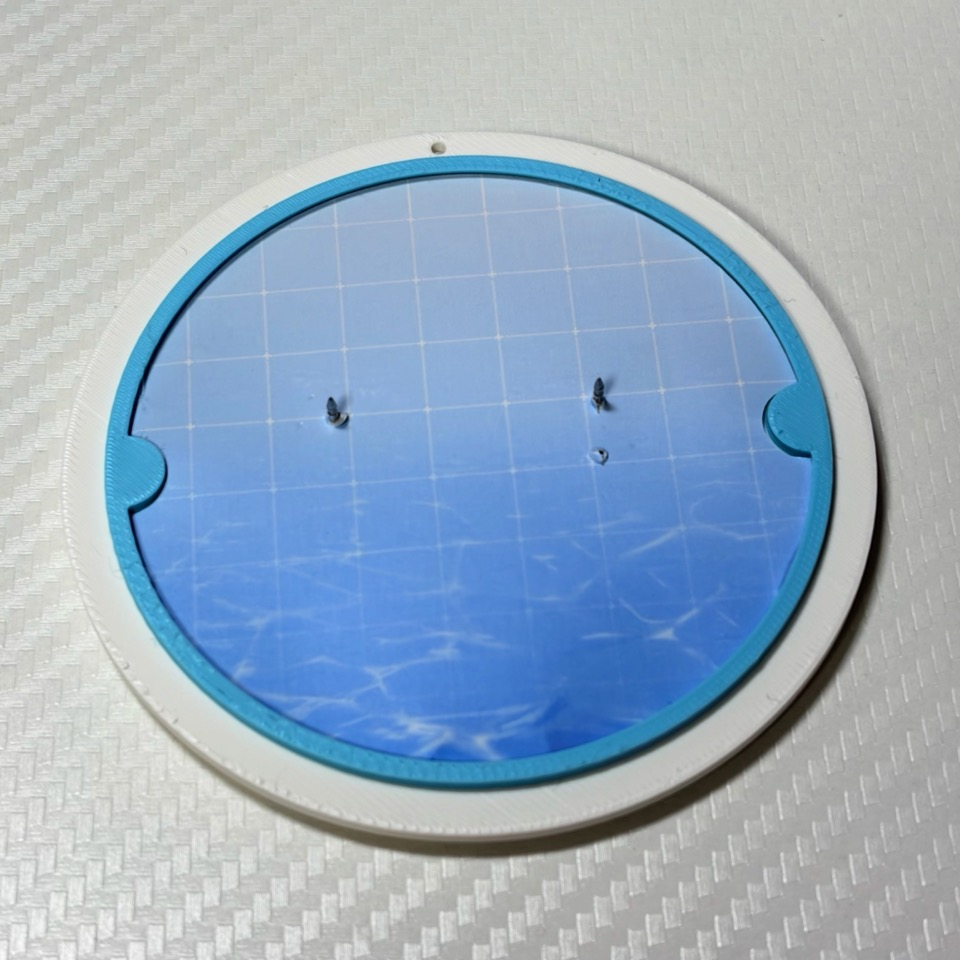

1. 배지를 다시 전면에 위치시키고, 어댑터의 전면에 있는 구멍에 핀을 통과시켜 고정합니다.
   Reposition the badge to the front and pass the pin through the hole on the front of the adapter to secure it.
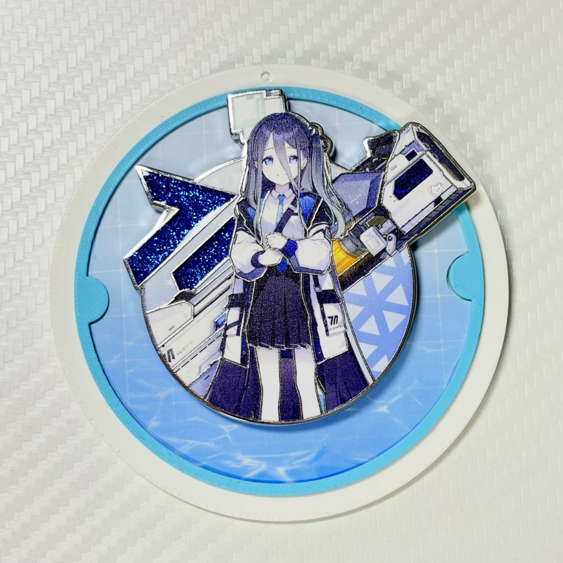
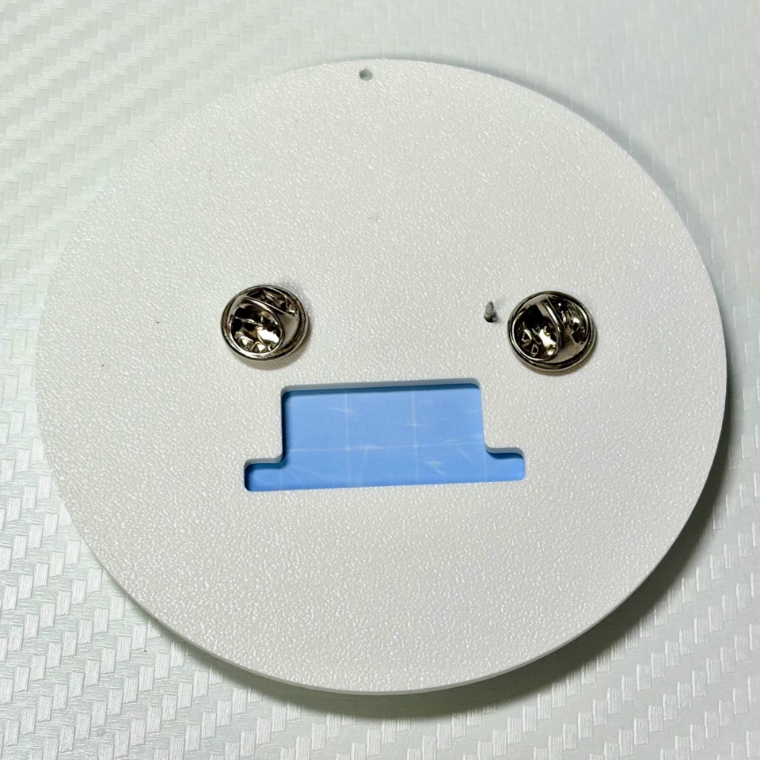

1. 마지막으로, 어댑터의 상단에 있는 구멍에 키체인을 연결하여 완성합니다.  
   Finally, attach a keychain to the hole at the top of the adapter to complete the assembly.
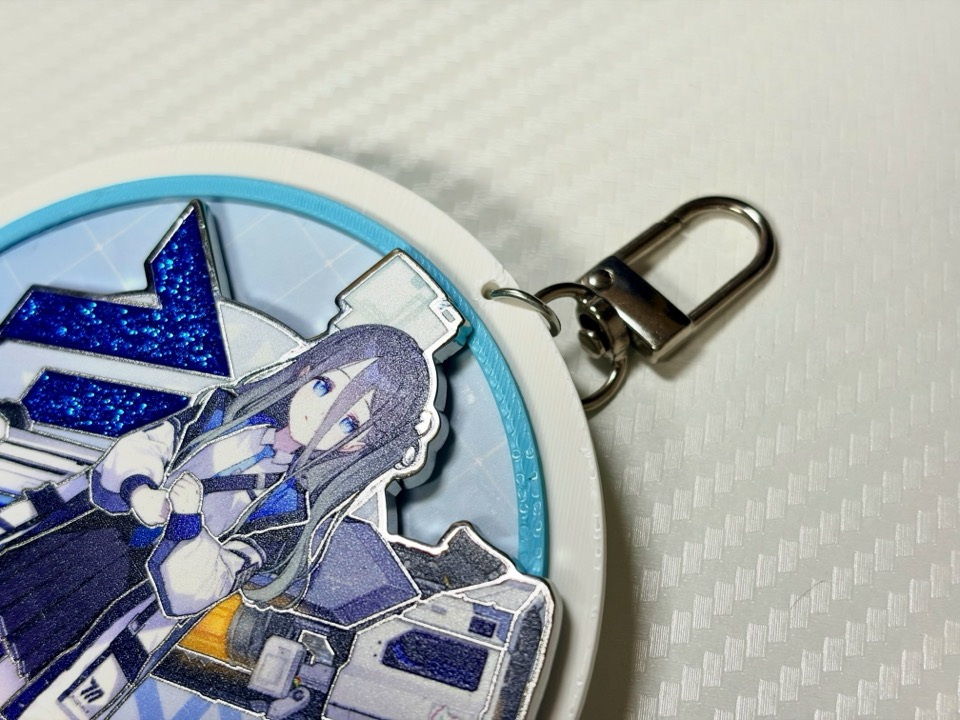

## Sample
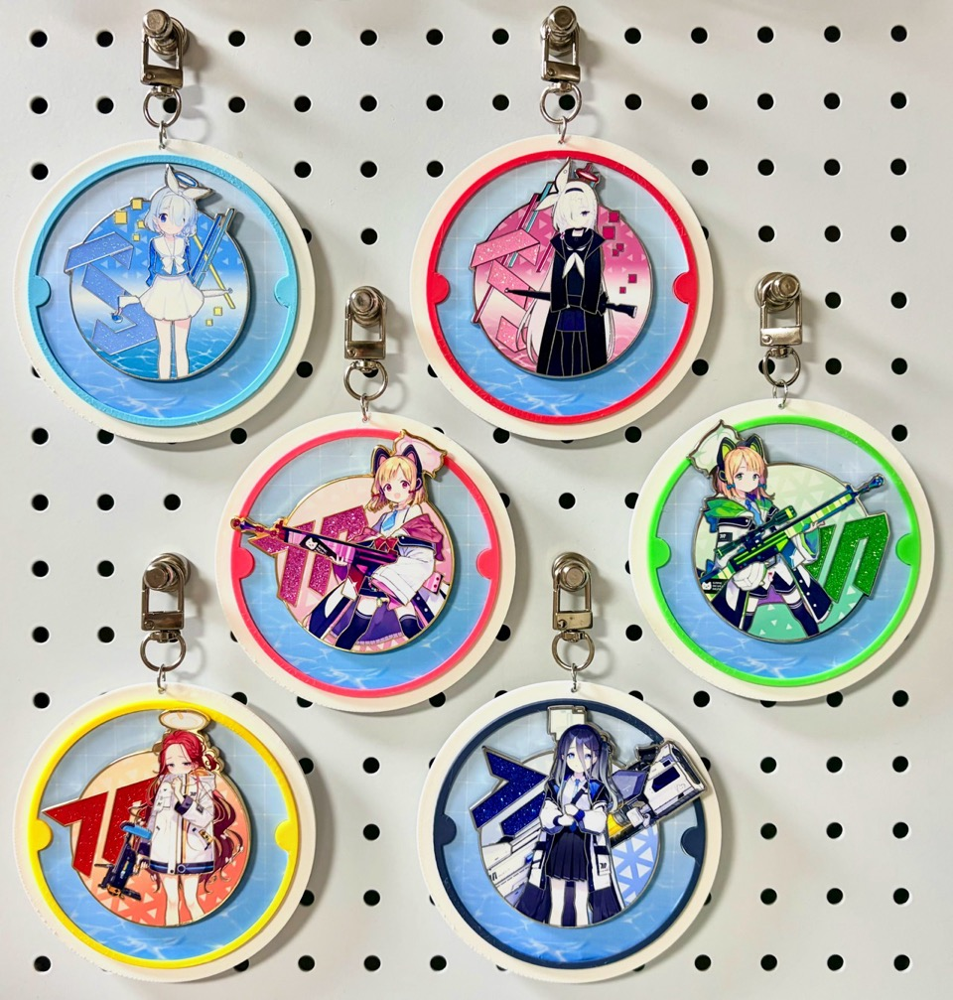